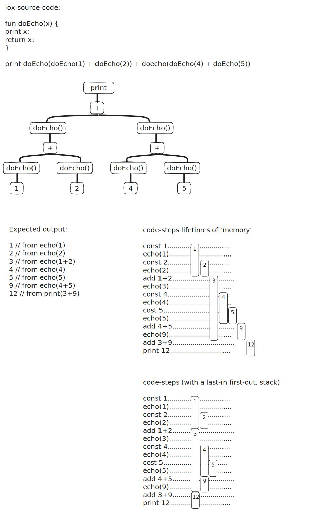
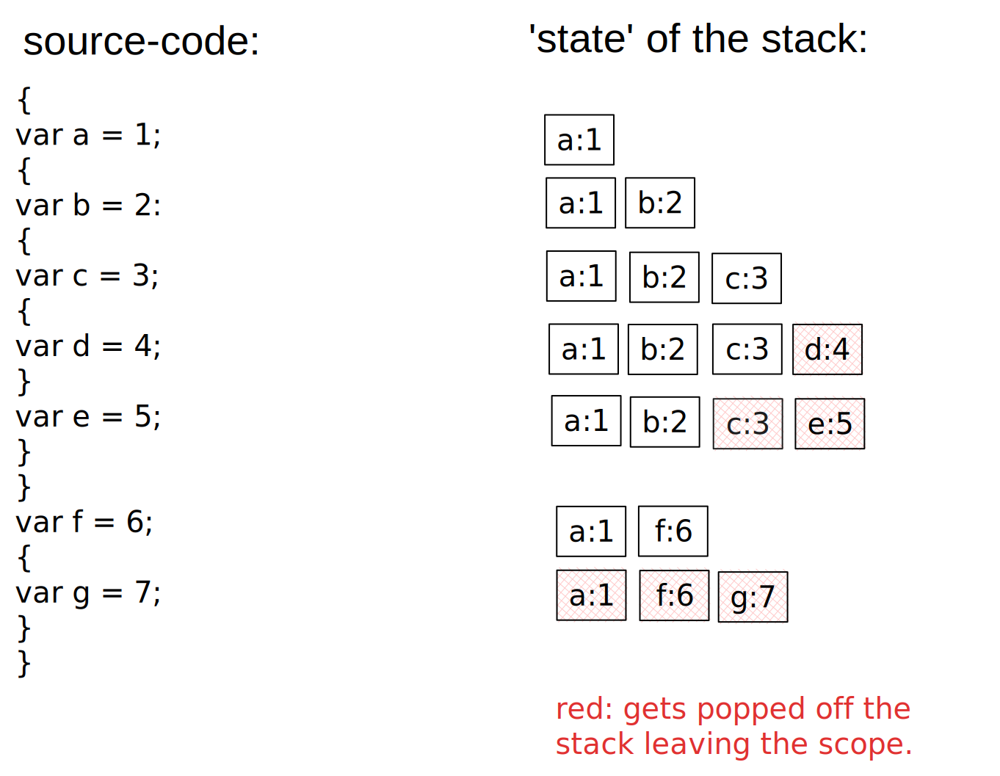

# Codealong for crafting interpreters - the clox Variant in c
The book Crafting Interpreters by Robert Nystrom as a guide, the goal is to dip my toes into writing a bytecode-compiler/vm.

- Link to a wasm-build of the interpreter running in a browser: https://vincepr.github.io/c_compiler/
## Notes arround implementation details (mostly for my later self)
### A Value Stack Manipulator - The VM's Stack
- the jlox interpreter accomplished by recursively traversing(postorder traversal) the AST.
- But since the interpret() run() function of the clox is flattened out, a place for tempory values is needed (the Value Stack Manipulator)



- as shown in the above we can just make a stack for our values to store, that we push onto if we need a new temp store or pop off, as needed.

### String Interning
- The Problem: string comparison (if they are not the same instance/pointer) is slow.

String Interning is a process of deduplication. So textually identical strings will use the same underlying collection of data.

- This makes checking for string equality trivial. Since they would re-use the same original data.


We implement this by storing all active strings in Hash Table. (located in the vm-module `vm.c`)

#### Why this had to be done
- The cost of creating strings (additional interning happens here) has risen.

- BUT in return at runtime the equality operator runs way way faster. (since it just compares 2 pointers now!)
    - This is a must for our object dynamically-typed/oriented lox. Since method calls, or fields on classes are looked up as string identified identifiers/names at runtime.
    - so if those are slow everything will run slow.

### (global) Variables
jlox implemented variables by building a chain of environments, one for each scope. This will create a new hash table each time you change scope. So its to slow.

#### general info about variables in lox
**Global variables** in Lox are 'late bound' (aka resolved after compile time), or resolved dynamically. This means a function can be compiled, that uses a variable that gets declared later on. As long as the code does not **execute** before that definition happens.

**Local variables** on the other hand always get declared before beeing used. Thus our single pass compiler can resolve them at run time more easily.

#### Assignment
- The problem below is, the single-pass compiler, does not know that this is assignment, till it reaches the `=`
- By that point the compiler already has emitted bytecode for the whole thing up to it.
```
menu.brunch(sunday).beverage = "hello world";
```
- Variables only need a single identifier (before the `=`)
- The idea is, that **before** compiling an expression that could be as an assignment, we peek ahead for an `=`.
    - if we find a `=` we treat is as assignment or setter.
    - if not we compile it

### (local) Variables
They are not late bound, so different from globals, they need to be assigned before use.
- They are lexical scoped.
- for performance reasons we can just push/pop them on the stack. We can use the same stack we use to evaluate expressions.


- as seen above, all we need is keep track of the **offset**, to identify where on the stack each value is (ex `a`  after line 6, would need an offset of 2 down from the top).


## Control Flow (Jumping Back and Forth)
### if and if else
```
if (expression) print-statement;
```
The idea (for a simple if statment) is to Jump to after the statment if the condition is true.
#### Backpatching
- But we cant know how far to jump. Before actually parsing the (print-)statement.
- The solution used is called Backpatching. 
    - We emit the jump instruction with a placeholder for the goto-value
    - after compiling the statement, we go back and replace that placeholder offset with the real one.

### Logical Operators
And and Or are mathematically binary operators. BUT they function more like control flow.

As in this: `true AND thisFnNeverGetsRun() AND alsoNotRun()` the functions get never run, since they are short-circuit after the `true AND`

## Function
### what is a function (from the perspective of the VM)
- A function has a body that can be executed, gets compiled to bytecode.
- Each Function gets its own Chunk, with some extra Metadata: `ObjFunction`
- Functions are first class in lox so they each are `Obj`.

When compiling: 
- Once the compiler hits a function declaration it stops writing to the current chunk.
- It then writes all code in the function body to a new chunk, afterwards switches back to the active chunk.

### Call Frames
#### Allocating local variables:
Local variables and temporaries behave in a last-in-first-out fashion. This even holds true with function calls.
- This enables us to use a stack.

At the beginning of each function call, the VM records the location of the first slot(*starting slot*) where that functions own locals begin.
- The instructions for working with local variables access them by a slot index relative to that. (instead of relative to the top/bottom)
    - at runtime we can convert the relative to absulute by adding the *starting slot*.
- The historic name for this recorded location (starting slot) is a **frame pointer**. Because it points to the beginning of the functions call frame.

#### Return adresses
Before implementing Functions, all the VM had to do was increment the ip-field, or add/subtract an offset for jumps.

Now the VM has to return back to the chunk where the function was called from, directly after the function call. This is called **return address** because its the address of the instruction that the VM returns to after the call.

#### The call stack - CallFrame
So we add the `CallFrame` struct that we can stack all the return addresses to. (so even multiple recursions become just one more entry in our CallFrame)

#### Function Calls
A function call expression is kind of an infix `(` operator. first the `functionName(someArugments, separatedByComma)`

#### Binding Arguments to parameters

```
fun sum(a, b, c) {
    return a + b + c;
}

print 4 + sum(5, 4, 7);
```
The following Stack Windows (startIdx -> endIdx on the Stack, given from how many parameters the function takes)
- when the compiler compiled `sum(a,b,c)` it located slots for the parameters a, b, c
    - something like `| sum |  a  |  b  |  c  |` for the function-declartation
    - something like `|  0  |  5  |  6  |  7  |` for the function-call
- so all we need to do is to match up those 2 windows to the Stack, and its easy to match `a->5, b->6, c->7`
    - this means no real binding of one value to another with pointers or even worse the heap neccessary. All happens on the 2 stacks, so it should be really fast

#### Return Statements
We do recursive descent during parsing, but at runtime the VM's bytecode dispatch loop is completely flat.
So returning some function is as easy, as returning from the end of the functions body.

### Closure