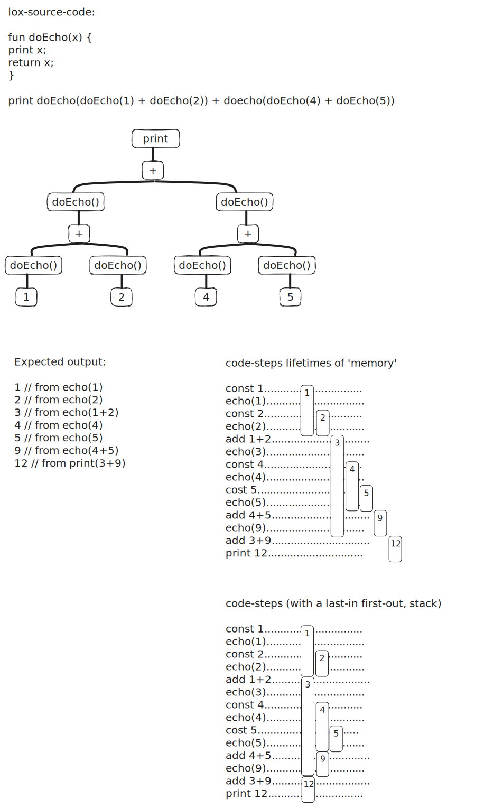

# Codealong for crafting interpreters - the clox Variant in c
The book Crafting Interpreters by Robert Nystrom as a guide, the goal is to dip my toes into writing a compiler/vm.
## Notes
### A Value Stack Manipulator - The VM's Stack
- the jlox interpreter accomplished by recursively traversing(postorder traversal) the AST.
- But since the interpret() run() function of the clox is flattened out, a place for tempory values is needed (the Value Stack Manipulator)

- as shown in the above we can just make a stack for our values to store, that we push onto if we need a new temp store or pop off, as needed.

### String Interning
- The Problem: string comparison (if they are not the same instance/pointer) is slow.

String Interning is a process of deduplication. So textually identical strings will use the same underlying collection of data.

- This makes checking for string equality trivial. Since they would re-use the same original data.

We implement this by storing all active strings in Hash Table. (located in the vm-module `vm.c`)

#### Why this had to be done
- The cost of creating strings (additional interning happens here) has risen.

- BUT in return at runtime the equality operator runs way way faster. (since it just compares 2 pointers now!)
    - This is a must for our object dynamically-typed/oriented lox. Since method calls, or fields on classes are looked up as string identified identifiers/names at runtime.
    - so if those are slow everything will run slow.