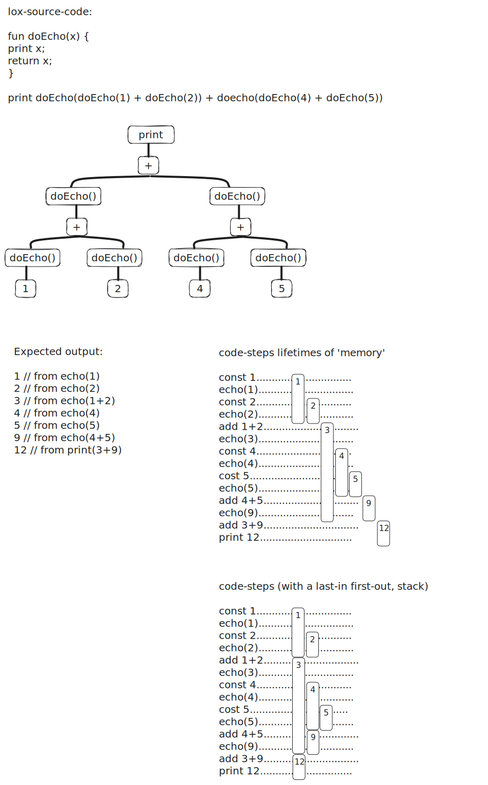

# Notes
Notes arround implementation details (mostly for my later self)

- Link to a wasm-build of the interpreter running in a browser: https://vincepr.github.io/c_compiler/

### A Value Stack Manipulator - The VM's Stack
- the jlox interpreter accomplished by recursively traversing(postorder traversal) the AST.
- But since the interpret() run() function of the clox is flattened out, a place for tempory values is needed (the Value Stack Manipulator)



- as shown in the above we can just make a stack for our values to store, that we push onto if we need a new temp store or pop off, as needed.

### String Interning
- The Problem: string comparison (if they are not the same instance/pointer) is slow.

String Interning is a process of deduplication. So textually identical strings will use the same underlying collection of data.

- This makes checking for string equality trivial. Since they would re-use the same original data.


We implement this by storing all active strings in Hash Table. (located in the vm-module `vm.c`)

#### Why this had to be done
- The cost of creating strings (additional interning happens here) has risen.

- BUT in return at runtime the equality operator runs way way faster. (since it just compares 2 pointers now!)
    - This is a must for our object dynamically-typed/oriented lox. Since method calls, or fields on classes are looked up as string identified identifiers/names at runtime.
    - so if those are slow everything will run slow.

### (global) Variables
jlox implemented variables by building a chain of environments, one for each scope. This will create a new hash table each time you change scope. So its to slow.

#### general info about variables in lox
**Global variables** in Lox are 'late bound' (aka resolved after compile time), or resolved dynamically. This means a function can be compiled, that uses a variable that gets declared later on. As long as the code does not **execute** before that definition happens.

**Local variables** on the other hand always get declared before beeing used. Thus our single pass compiler can resolve them at run time more easily.

#### Assignment
- The problem below is, the single-pass compiler, does not know that this is assignment, till it reaches the `=`
- By that point the compiler already has emitted bytecode for the whole thing up to it.
```
menu.brunch(sunday).beverage = "hello world";
```
- Variables only need a single identifier (before the `=`)
- The idea is, that **before** compiling an expression that could be as an assignment, we peek ahead for an `=`.
    - if we find a `=` we treat is as assignment or setter.
    - if not we compile it

### (local) Variables
They are not late bound, so different from globals, they need to be assigned before use.
- They are lexical scoped.
- for performance reasons we can just push/pop them on the stack. We can use the same stack we use to evaluate expressions.


- as seen above, all we need is keep track of the **offset**, to identify where on the stack each value is (ex `a`  after line 6, would need an offset of 2 down from the top).


## Control Flow (Jumping Back and Forth)
### if and if else
```
if (expression) print-statement;
```
The idea (for a simple if statment) is to Jump to after the statment if the condition is true.
#### Backpatching
- But we cant know how far to jump. Before actually parsing the (print-)statement.
- The solution used is called Backpatching. 
    - We emit the jump instruction with a placeholder for the goto-value
    - after compiling the statement, we go back and replace that placeholder offset with the real one.

### Logical Operators
And and Or are mathematically binary operators. BUT they function more like control flow.

As in this: `true AND thisFnNeverGetsRun() AND alsoNotRun()` the functions get never run, since they are short-circuit after the `true AND`

## Function
### what is a function (from the perspective of the VM)
- A function has a body that can be executed, gets compiled to bytecode.
- Each Function gets its own Chunk, with some extra Metadata: `ObjFunction`
- Functions are first class in lox so they each are `Obj`.

When compiling: 
- Once the compiler hits a function declaration it stops writing to the current chunk.
- It then writes all code in the function body to a new chunk, afterwards switches back to the active chunk.

### Call Frames
#### Allocating local variables:
Local variables and temporaries behave in a last-in-first-out fashion. This even holds true with function calls.
- This enables us to use a stack.

At the beginning of each function call, the VM records the location of the first slot(*starting slot*) where that functions own locals begin.
- The instructions for working with local variables access them by a slot index relative to that. (instead of relative to the top/bottom)
    - at runtime we can convert the relative to absulute by adding the *starting slot*.
- The historic name for this recorded location (starting slot) is a **frame pointer**. Because it points to the beginning of the functions call frame.

#### Return adresses
Before implementing Functions, all the VM had to do was increment the ip-field, or add/subtract an offset for jumps.

Now the VM has to return back to the chunk where the function was called from, directly after the function call. This is called **return address** because its the address of the instruction that the VM returns to after the call.

#### The call stack - CallFrame
So we add the `CallFrame` struct that we can stack all the return addresses to. (so even multiple recursions become just one more entry in our CallFrame)

#### Function Calls
A function call expression is kind of an infix `(` operator. first the `functionName(someArugments, separatedByComma)`

#### Binding Arguments to parameters

```
fun sum(a, b, c) {
    return a + b + c;
}

print 4 + sum(5, 4, 7);
```
The following Stack Windows (startIdx -> endIdx on the Stack, given from how many parameters the function takes)
- when the compiler compiled `sum(a,b,c)` it located slots for the parameters a, b, c
    - something like `| sum |  a  |  b  |  c  |` for the function-declartation
    - something like `|  0  |  5  |  6  |  7  |` for the function-call
- so all we need to do is to match up those 2 windows to the Stack, and its easy to match `a->5, b->6, c->7`
    - this means no real binding of one value to another with pointers or even worse the heap neccessary. All happens on the 2 stacks, so it should be really fast

#### Return Statements
We do recursive descent during parsing, but at runtime the VM's bytecode dispatch loop is completely flat.
So returning some function is as easy, as returning from the end of the functions body.

### Closure implementation
Goal is to use the stack for local variables, for all its benefits. The Problem is, a inner function needs access to all local scopes of functions/scopes that encompass it.

With our stack based approach we need to implement quite some extra logic to make them available properly.

#### Closure Objects
- The VM represents functions at runtime using `ObjFunction`. Those are created **only** during compilation.
    - At runtime the VM loads the function object from a constant table and binds it to a name

This no longer is enough to make closures work:
```lox
fun closureFactory(value) {
    fun closure() {
        print value;
    }
    return closure
}

var x1 = closureFactory("bob");
var x2 = closureFactory("ross");

x2();   // should print -> ross
x1();   // should print -> bob
```
- In the above example we need some runtime representation for a closure, that captures the local variables surrounding the function as they exist when the function declaration is executed (not when compiled)

- We wrap every function in an Closure Object: `ObjClosure`. Our VM never touches Functions at runtime, only the wrapper Closures.

#### Upvalues
An upvalue refers to a local variable enclosing function. Every closure maintains an array of upvalues, one for each surrounding local variable (that the closure uses).
- It points back into the stack, where the variable captured lives.
- When a function declaration is first executed, the VM creates the array of upvalues and captures the surrounding local variables (it needs)

```lox
var x = 9;
fun doThings() {
    print x;
}
```
- here the struct in memory should be an array that points to the place in memory the x=9 is stored in.

##### Closed Upvalues
A feature of closures is, that they hold onto vairables as long as needed. Even after the function itself has returned.
- ObjUpvalue will store the closed over variables on the heap.
- As long as the variable is on the stack, there may be code that still needs it there. So once the local variable goes out of scope, we can move that value to the heap

The `OP_CLOSE_UPVALUE` bytecode takes ownership of a local variable, that is leaving scope. By storing it on the heap.

At runtime the VM stores a list of all upvalues that capture a particular local variable that way. Because otherwise 2 closures pointing/capturing the same variable would not be possible. `ObjUpvalue* openUpvalues;` in the VM struct.

## GC - Garbage Collection
### Defining reachability
- All roots are reachable. (roots are any object that the VM can reach directly, ex. global or variable on the stack)
- Any object referred to from a reachable object is itself reachable. (ex. some root points to some obj on the heap)

These are the values that still live and need to stay in memory. Any other value can be GC'd.

### Rules for our GC
- starting with the roots, traverse trough object references to find the full set of unreachable objects.
- Free all objects not in that Set (Our Hashmap we can 'abuse' as HashSet).

### Mark-Sweep Garbage Collection
Originates from Lisp. 2 Phases. Is a **tracing garbage collector**. (vs reference counting)
- **Marking:** start at roots and graph traverse all reachable objects. Each time we visit an object we mark it. (so we can stop if we hit again)
- **Sweeping:** now go trough all unmarked ojects and free them.

### Tricolor abstraction
As the Collector walks the grap of objects we have to make sure it doesnt get stuck or skips anything.
- **White**: we have not reached the object at all.
- **Gray**: during marking when we first reach an object. BUT we have not checked (or checked all paths) if it further links to other Objects
- **Black**: we have marked all the object it references. (the GC-Algorithm is done with this node)

Now a simple alorithm emerges:
1. Start all nodes white.
2. find all roots and mark them gray.
3. repeat while there are still gray nodes:
    1. pick a gray object. Turn any white objects that it holds reference to gray.
    2. mark the object from previous step black.

### Weak references and string pool
A **weak reference** is a reference that does not protect the referenced object from collection by the GC. We have to handle our string pool this way. The string pool does not get treated as source of roots. 

Removing references to unreachable strings, we do handle specially in `tableRemoveWhite()`, after the mark phase completed (but before `sweep()`).

### How often to GC
- optional debug flag: `DEBUG_STRESS_GC` will trigger GC at every possible step (for debugging GC problems)
- Throughput: throughput 90% means we spend 90% of the time running the programm and 10% on GC overhead.
- Latency: largest continous time a GC-cycle takes. 

clox's gc-collection frequency strategy: **Self-adjusting heap**:

- GC collector frequency automatically adjusts based on the live size of the heap. We track the toal number of bytes of managed memory the VM has allocated. When it goes above a threshold we trigger GC. After GC we note the current size and set the next threshold.

## Optimisations
### Superinstruction - a set of Instruction gets replaced by a special optimized one
Previously, every time a Method is called, the `BoundMethod` struct is created by the bytecode instruction and then consumed. So for 10 method calls 10 allocations for that struct happen. the next bytecode instruction then consumes that BoundMethod.

Idea is that we can at compile time instead emit a new special instruction that performs an optimized method call: `OP_INVOKE`.
- Similar we use `OP_SUPER_INVOKE` for a fast shortcut thant `OP_GET_SUPER` followed by `OP_CALL` so we can squeze out an expensive lookup by reordering our stack a bit.

### The big baddie - the lookup in our table
Since we need to lookup our table for each invokation, functioncall etc. a lot of time is spend in `tableGet()`. And that again mainly uses `findEntry()` to lookup entries in our HashMap.

especially this one line:
```
uint32_t index = key->hash % capacity;
```
- modulo and division are about 30-50 times slower than addition, subtraction or a pointer dereferencing. So the problem is found.


#### The solution
Since we calculate a number modulo a power of 2, we can use that knowledge to instead do a decrement and a bitwise AND. (operations cpus love)

so the above line would become:
```
uint32_t index = key->hash & (capacity -1);
```
- we can used that trick in 4 places (2 in findEntry and 2 in TableFindString)

